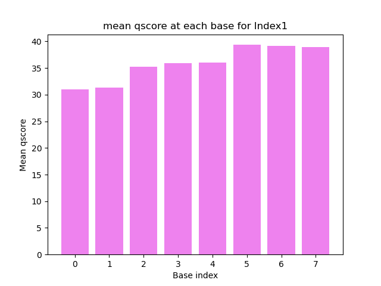
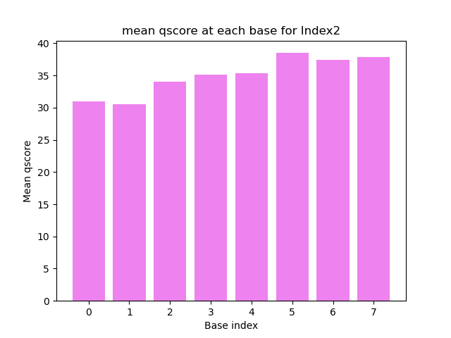
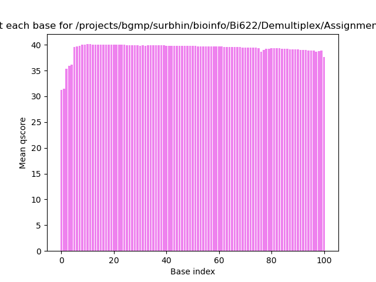
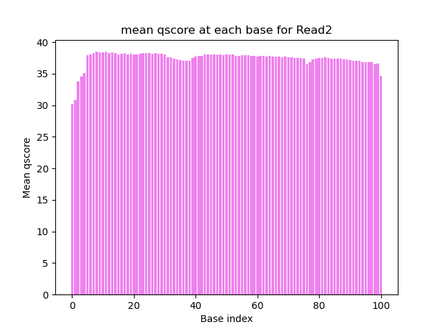

# Assignment the First

## Part 1
1. Be sure to upload your Python script. Provide a link to it here:

| File name | label | Read length | Phred encoding |
|---|---|---|---|
| 1294_S1_L008_R1_001.fastq.gz |read1  | 101 | Phred+33 |
| 1294_S1_L008_R2_001.fastq.gz |index1  | 8 | Phred+33 |
| 1294_S1_L008_R3_001.fastq.gz |index2  | 8 | Phred+33 |
| 1294_S1_L008_R4_001.fastq.gz |read2 | 101 | Phred+33 |

A) Phred encoding used is phred-33 and I made an educated guess based on the reading here https://people.duke.edu/~ccc14/duke-hts-2018/bioinformatics/quality_scores.html Looks like 
the # symbol is not found in phred-64 (and it doesn't have numbers, alphabets can be lower case which is not the case in Phred+33), hence it is a phred-33 encoding.

B) Used the bottom command with all four reads (of course with changed file name) to find the length of each read. Since Illumina sequencing has the same read length for all the sequences in biological read (R1 and R4) and index (R2 and R3) I used head to find sequence length instead of using the entirity of the files. 

zcat /projects/bgmp/shared/2017_sequencing/1294_S1_L008_R4_001.fastq.gz | head -20 | sed -n '2~4p' | wc -L >> 101 is the sequence length

2. Per-base NT distribution
    1. Use markdown to insert your 4 histograms here.
       
       
       
       
    3. Q scores can reveal how much of the data from a given run is usable in resequencing or assembly experiment. Sequencing data with lower quality scores can result in significant portion of the reads being unusable, resulting in wasted time and expense. When sequencing quality reaches Q30, virtually all of the reads will be perfect, with no errors or ambiguities. This is why Q30 is considered a benchmark for quality in next-generation sequencing (NGS) source - https://www.illumina.com/science/technology/next-generation-sequencing/plan-experiments/quality-scores.html Hence cutoff should be at Q30 for the biological sequencing read. However, 
    4. Read 2/index 1: 3976613
       
       zcat /projects/bgmp/shared/2017_sequencing/1294_S1_L008_R2_001.fastq.gz | sed -n '2~4p' | grep -E "(N)" | wc -l
       
       Read 3/index 2: 3328051

       zcat /projects/bgmp/shared/2017_sequencing/1294_S1_L008_R3_001.fastq.gz | sed -n '2~4p' | grep -E "(N)" | wc -l
    
## Part 2
1. Define the problem
2. Describe output
3. Upload your [4 input FASTQ files](../TEST-input_FASTQ) and your [>=6 expected output FASTQ files](../TEST-output_FASTQ).
4. Pseudocode
5. High level functions. For each function, be sure to include:
    1. Description/doc string
    2. Function headers (name and parameters)
    3. Test examples for individual functions
    4. Return statement
